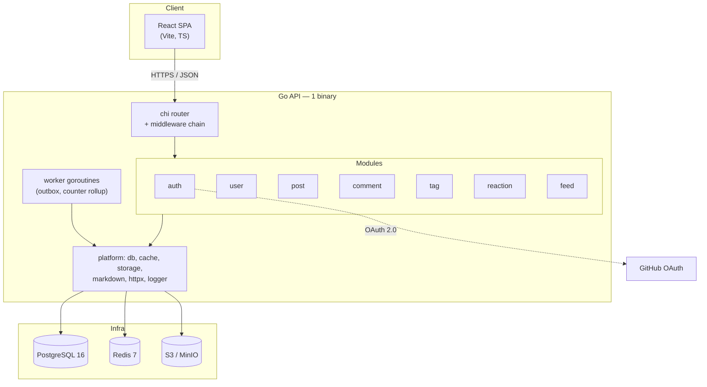

# 01 — Kiến trúc

## 1. Nguyên tắc

1. **Một binary, nhiều module.** Mỗi domain là một package độc lập với handler / service / repository riêng. Không có "layer" toàn cục kiểu `services/` chứa 40 file.
2. **Module chỉ nói chuyện qua interface.** Module A gọi module B thông qua interface do **A** khai báo (consumer-defined interface), B cung cấp implementation. Tuyệt đối không import repository của module khác.
3. **Không rò rỉ kiểu dữ liệu tầng dưới lên trên.** `sqlc` sinh ra struct riêng cho DB; repository chuyển chúng thành domain model. Handler chuyển domain model thành DTO. Không trả thẳng struct DB ra JSON.
4. **Tách được thành service riêng mà không phải viết lại.** Khi một module cần scale riêng, chỉ việc đổi implementation của interface thành gRPC client.
5. **Bối cảnh dự án cá nhân.** Không dựng Kafka, không event sourcing, không CQRS. Khi cần async (gửi mail, sync GitHub), dùng bảng outbox trong Postgres + worker goroutine.

## 2. Sơ đồ tổng thể



## 3. Cấu trúc thư mục

```
devhub/
├── backend/
│   ├── cmd/
│   │   ├── api/main.go              # điểm vào HTTP server
│   │   └── worker/main.go           # (phase sau) background jobs
│   ├── internal/
│   │   ├── config/                  # load env → struct, validate lúc khởi động
│   │   ├── server/
│   │   │   ├── server.go            # http.Server, graceful shutdown
│   │   │   └── router.go            # gắn middleware + gọi module.Register()
│   │   ├── modules/
│   │   │   ├── auth/
│   │   │   │   ├── module.go        # wiring + đăng ký route
│   │   │   │   ├── handler.go       # HTTP: decode → validate → gọi service
│   │   │   │   ├── service.go       # nghiệp vụ: OAuth flow, cấp/thu hồi token
│   │   │   │   ├── repository.go    # truy cập DB (bọc sqlc)
│   │   │   │   ├── dto.go           # request/response structs
│   │   │   │   ├── ports.go         # interface module này CẦN từ module khác
│   │   │   │   └── *_test.go
│   │   │   ├── user/
│   │   │   ├── post/
│   │   │   ├── comment/
│   │   │   ├── tag/
│   │   │   ├── reaction/
│   │   │   └── feed/
│   │   └── platform/                # hạ tầng dùng chung, KHÔNG chứa nghiệp vụ
│   │       ├── database/            # pgxpool, transaction manager
│   │       ├── cache/               # redis client + helper
│   │       ├── storage/             # S3 presigned upload
│   │       ├── markdown/            # goldmark → HTML sanitize (bluemonday)
│   │       ├── httpx/               # lỗi domain → lỗi huma
│   │       ├── api/                 # dựng huma.API trên chi, cấu hình OpenAPI
│   │       ├── middleware/          # request id, logger, recover, timeout, auth, rate limit
│   │       ├── token/               # JWT sign/verify
│   │       └── logger/              # slog có cấu trúc
│   ├── db/
│   │   ├── migrations/              # 000001_init.up.sql / .down.sql
│   │   └── queries/                 # *.sql cho sqlc
│   ├── sqlc.yaml
│   ├── Makefile
│   └── go.mod
├── frontend/
│   ├── src/
│   │   ├── app/                     # router, providers, theme, error boundary
│   │   ├── features/                # theo tính năng, không theo loại file
│   │   │   ├── auth/
│   │   │   ├── posts/               # list, detail, card
│   │   │   ├── editor/              # markdown editor + preview
│   │   │   ├── comments/
│   │   │   └── profile/
│   │   ├── shared/
│   │   │   ├── api/                 # fetch client, interceptor refresh token
│   │   │   ├── ui/                  # shadcn components
│   │   │   ├── hooks/
│   │   │   ├── lib/
│   │   │   └── types/               # kiểu sinh từ OpenAPI
│   │   └── main.tsx
│   ├── vite.config.ts
│   └── package.json
├── deploy/
│   ├── docker-compose.yml           # postgres, redis, minio
│   └── Dockerfile.api
└── docs/
```

Cây trên là **hình dạng cuối giai đoạn 1, không phải danh sách phải dựng ở Phase 0.** Mỗi thư mục ra đời khi có người gọi nó: Phase 0 chỉ cần `platform/{database,cache,logger,httpx}`; `token/` xuất hiện ở Phase 1 cùng auth; `markdown/` và `storage/` ở Phase 2 cùng bài viết. Tạo sẵn thư mục rỗng hoặc viết code chưa ai gọi là vi phạm `CLAUDE.md §1`.

## 4. Giải phẫu một module

Lấy `post` làm ví dụ. Bốn file, bốn trách nhiệm rõ ràng:

**`module.go`** — nơi duy nhất biết cách lắp ráp module:

```go
type Module struct {
	handler *Handler
	Service Service // export ra ngoài cho module khác dùng
}

func New(db *database.DB, cache *cache.Client, users UserFinder) *Module {
	repo := newRepository(db)
	svc := newService(repo, cache, users)
	return &Module{handler: newHandler(svc), Service: svc}
}

// Đăng ký operation vào huma.API — đây là code chạy lúc khởi động,
// nên OpenAPI spec luôn khớp với những gì server thực sự phục vụ.
func (m *Module) Register(api huma.API) {
	huma.Register(api, huma.Operation{
		OperationID: "listPosts",
		Method:      http.MethodGet,
		Path:        "/api/v1/posts",
		Summary:     "Danh sách bài viết đã xuất bản",
		Tags:        []string{"posts"},
	}, m.handler.list)

	huma.Register(api, huma.Operation{
		OperationID:   "createPost",
		Method:        http.MethodPost,
		Path:          "/api/v1/posts",
		Summary:       "Tạo bài viết mới ở trạng thái nháp",
		Tags:          []string{"posts"},
		Security:      []map[string][]string{{"bearer": {}}}, // yêu cầu đăng nhập
		DefaultStatus: http.StatusCreated,
	}, m.handler.create)

	// ... update, delete, publish
}
```

**`ports.go`** — interface do chính module này định nghĩa, mô tả đúng thứ nó cần:

```go
// post cần biết tên hiển thị của tác giả, chỉ vậy thôi.
// KHÔNG import user.Repository, KHÔNG import user.User.
type UserFinder interface {
	FindBrief(ctx context.Context, ids []uuid.UUID) (map[uuid.UUID]AuthorBrief, error)
}
```

Điểm mấu chốt: nếu sau này `user` tách ra thành service riêng, chỉ cần một implementation `UserFinder` gọi gRPC. Module `post` không sửa một dòng nào.

**`service.go`** — chứa toàn bộ nghiệp vụ, không biết gì về HTTP:

```go
func (s *service) Publish(ctx context.Context, actorID, postID uuid.UUID) (*Post, error) {
	p, err := s.repo.GetByID(ctx, postID)
	if err != nil { return nil, err }
	if p.AuthorID != actorID { return nil, ErrForbidden }
	if p.Status == StatusPublished { return p, nil } // idempotent
	if strings.TrimSpace(p.Title) == "" { return nil, ErrEmptyTitle }
	...
}
```

**`handler.go`** — chỉ dịch HTTP ↔ service. Không `if` nghiệp vụ nào ở đây. Với `huma`, input đã được validate theo schema trước khi hàm chạy, nên handler gọn hơn nữa:

```go
func (h *Handler) create(ctx context.Context, in *CreatePostInput) (*PostOutput, error) {
	actor := auth.MustFromContext(ctx)
	p, err := h.svc.Create(ctx, actor.ID, toCreateParams(in))
	if err != nil {
		return nil, httpx.ToHuma(err)   // chuyển lỗi domain → lỗi HTTP, một chỗ duy nhất
	}
	return &PostOutput{Body: toDTO(p)}, nil
}
```

`huma` **chỉ chạm tới file này**. `service.go` và `repository.go` không import `huma`, nên nếu sau này bỏ nó thì phần phải viết lại đúng bằng một tầng mỏng nhất.

## 5. Chuỗi middleware

Middleware vẫn là middleware `chi` chuẩn — `huma` gắn lên trên `chi` qua adapter `humachi`, không thay thế nó.

Thứ tự đăng ký (ngoài vào trong):

| # | Middleware | Nhiệm vụ |
|---|---|---|
| 1 | `RequestID` | sinh/nhận `X-Request-ID`, đưa vào context |
| 2 | `RealIP` | lấy IP thật sau proxy |
| 3 | `Recoverer` | bắt panic → 500 + log stack, không sập server |
| 4 | `Logger` | slog: method, path, status, duration, request_id, user_id |
| 5 | `Timeout` | 15s cho request thường |
| 6 | `RateLimit` | Redis sliding window; theo user_id nếu đã login, theo IP nếu chưa |
| 7 | `Auth` | chỉ gắn cho route cần — verify JWT, nạp user vào context |

**Không có middleware CORS, và đó là chủ đích.** Frontend cùng origin với API (§9): production do Caddy phục vụ file tĩnh ở `/` và proxy `/api/*` sang Go; dev thì `server.proxy` của Vite làm đúng việc đó. Trình duyệt nhìn thấy mọi request là same-origin nên preflight không bao giờ xảy ra.

Bỏ được CORS không chỉ là bớt một middleware — nó xoá luôn cả một nhóm lỗi cấu hình (thiếu origin trong whitelist, quên `credentials: true`, preflight bị rate limit chặn) và giữ cho cookie refresh token dùng được `SameSite=Strict`.

## 6. Xử lý lỗi

Một kiểu lỗi domain duy nhất, map sang HTTP ở đúng một chỗ (`platform/httpx`):

```go
type Error struct {
	Code    string // "post_not_found", "forbidden", "validation_failed"
	Message string // hiển thị được cho người dùng
	Err     error  // lỗi gốc, chỉ để log — không lộ ra response
	Fields  map[string]string // lỗi từng field khi validate
}
```

Service trả `*httpx.Error` — thuần domain, không import `huma`. Handler gọi `httpx.ToHuma(err)` để chuyển sang lỗi HTTP. Bảng map code → status nằm gọn một chỗ, không rải `w.WriteHeader(404)` khắp nơi.

## 7. Xác thực

- **Access token**: JWT (HS256), sống 15 phút, chứa `sub`, `username`, `exp`, `jti`. Frontend giữ **trong memory**, gửi qua header `Authorization: Bearer`. Không để trong localStorage (chống XSS đọc trộm), không để trong cookie gửi tự động (khỏi lo CSRF).
- **Refresh token**: chuỗi ngẫu nhiên 32 byte, lưu **hash** trong DB, sống 30 ngày. Đặt trong cookie `HttpOnly; Secure; SameSite=Strict; Path=/api/v1/auth` — cookie chỉ được gửi tới nhóm endpoint auth (`refresh` và `logout`, cả hai đều cần đọc nó), nên không có bề mặt CSRF cho các API khác. `Secure` bật theo môi trường: tắt khi dev để cookie đi qua `http://localhost`, bật ở production.
- **Xoay vòng token**: mỗi lần refresh sinh token mới và thu hồi token cũ. Nếu một refresh token đã thu hồi bị dùng lại → coi như bị đánh cắp, thu hồi toàn bộ session của user đó.

Chi tiết luồng OAuth xem [03-api.md](03-api.md#2-luồng-xác-thực).

## 8. Bất biến & tác vụ nền

Bộ đếm (số reaction, số comment, lượt xem) không đọc bằng `COUNT(*)` mỗi request. Ba mức:

1. **Ghi ngay**: `reaction_count` là cột trên `posts`, cập nhật trong cùng transaction với việc chèn reaction. Chính xác tuyệt đối, chi phí thấp vì tần suất thấp.
2. **Gộp rồi ghi**: lượt xem đẩy vào Redis (`INCR post:views:{id}`), một goroutine flush xuống Postgres mỗi 60 giây. Sai lệch tối đa 60s — chấp nhận được với chỉ số này.
3. **Đối soát**: cron hằng ngày `COUNT(*)` lại và sửa cột đếm nếu lệch.

## 9. Hình trạng triển khai

**Frontend và API dùng chung một origin.** Caddy đứng trước, phục vụ bản build tĩnh của React ở `/` và proxy `/api/*` sang Go.

```
                    ┌──────────── Caddy (TLS tự động) ────────────┐
  devhub.dev  ────► │  /          → frontend/dist (file tĩnh)     │
                    │  /api/*     → 127.0.0.1:8080 (Go API)       │
                    └─────────────────────────────────────────────┘
```

Lúc dev, `server.proxy` của Vite lặp lại đúng hình trạng này (`/api` → `localhost:8080`), nên môi trường dev và production hành xử giống nhau về mặt origin.

Ba hệ quả kéo theo, tất cả đều theo hướng đơn giản hơn:

1. **Không cần CORS** (§5).
2. **Cookie refresh token giữ được `SameSite=Strict`** đúng như thiết kế ở [03-api.md §2](03-api.md#2-luồng-xác-thực). Nếu tách frontend sang host khác site (ví dụ Vercel), cookie `Strict` sẽ bị trình duyệt chặn hoàn toàn và phải hạ xuống `SameSite=None`, mở lại đúng bề mặt CSRF mà thiết kế này đang tránh.
3. **Không có biến `API_BASE_URL`** ở frontend — mọi lời gọi là đường dẫn tương đối `/api/v1/...`.

Đánh đổi: frontend phải deploy cùng VPS, không dùng được CDN dựng sẵn của Vercel/Netlify. Với quy mô này thì Caddy phục vụ file tĩnh là quá đủ; khi cần CDN thì đặt Cloudflare trước toàn bộ domain, không phải tách origin.

## 10. Quan sát hệ thống (observability)

- **Log**: `slog` dạng JSON, luôn kèm `request_id` và `user_id`.
- **Metrics**: `/metrics` Prometheus — request duration theo route, kết nối pool DB, tỉ lệ cache hit.
- **Health**: `/healthz` (liveness, luôn 200) và `/readyz` (ping Postgres + Redis).

## 11. Những gì cố tình KHÔNG làm ở giai đoạn 1

| Bỏ qua | Lý do |
|---|---|
| Kafka / message queue | Outbox table + goroutine đủ dùng ở quy mô này |
| Elasticsearch / Meilisearch | Postgres full-text đủ tới ~100k bài |
| Kubernetes | Một VPS + docker compose |
| gRPC nội bộ | Đang là một binary, gọi hàm trực tiếp |
| Multi-tenant, i18n | Chưa có nhu cầu, thêm sau rẻ hơn gỡ ra |
| SSR / Next.js | SPA + prerender cho trang bài viết là đủ cho SEO ban đầu |
