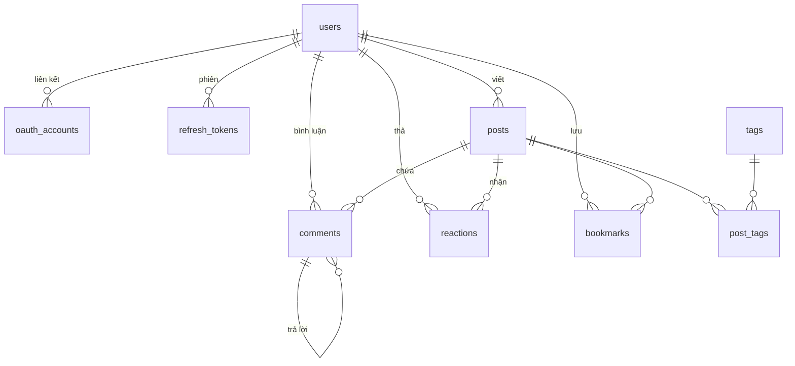

# 02 — Data Model

PostgreSQL 16. Toàn bộ DDL dưới đây là nội dung của migration đầu tiên (`000001_init`), trừ mục §9 (giai đoạn sau).

## 1. Quy ước chung

| Quy ước | Quyết định | Lý do |
|---|---|---|
| Khoá chính | `UUID` v7 sinh ở tầng Go (`uuid.NewV7()`) | Sắp theo thời gian → index không phân mảnh như UUIDv4, nhưng không lộ số lượng bản ghi như `bigserial` |
| Thời gian | `TIMESTAMPTZ`, luôn lưu UTC | Không bao giờ dùng `TIMESTAMP` trần |
| Xoá | Soft delete (`deleted_at`) cho `posts` và `comments`; hard delete cho phần còn lại | Bài/bình luận cần khôi phục được và giữ nguyên chuỗi hội thoại |
| Đặt tên | `snake_case`, bảng số nhiều | |
| Enum | `TEXT` + `CHECK` constraint | Thêm giá trị mới chỉ cần sửa constraint; `ALTER TYPE` của enum Postgres phiền hơn |
| Chuỗi | `TEXT` + `CHECK (length(...))` | `VARCHAR(n)` không nhanh hơn trong Postgres |

Extension cần bật:

```sql
CREATE EXTENSION IF NOT EXISTS pg_trgm;   -- tìm kiếm gần đúng cho tag/username
CREATE EXTENSION IF NOT EXISTS citext;    -- so sánh username/email không phân biệt hoa thường
```

## 2. Sơ đồ quan hệ



## 3. Người dùng & xác thực

### `users`

```sql
CREATE TABLE users (
    id              UUID PRIMARY KEY,
    username        CITEXT NOT NULL UNIQUE,
    email           CITEXT UNIQUE,
    display_name    TEXT NOT NULL,
    avatar_url      TEXT,
    bio             TEXT CHECK (length(bio) <= 300),
    website_url     TEXT,
    github_username TEXT,
    location        TEXT,
    role            TEXT NOT NULL DEFAULT 'user'
                    CHECK (role IN ('user', 'moderator', 'admin')),
    is_suspended    BOOLEAN NOT NULL DEFAULT FALSE,
    created_at      TIMESTAMPTZ NOT NULL DEFAULT now(),
    updated_at      TIMESTAMPTZ NOT NULL DEFAULT now(),

    CONSTRAINT username_format CHECK (username ~ '^[a-zA-Z0-9_-]{3,30}$')
);
```

`email` cho phép `NULL` vì GitHub có thể không trả email nếu người dùng để riêng tư. Ràng buộc `UNIQUE` trên cột nullable trong Postgres bỏ qua các dòng `NULL`, đúng như mong muốn.

Không có cột `password_hash` — MVP chỉ đăng nhập qua GitHub. Khi thêm email/password sau này thì thêm bảng `credentials` riêng, không nhét thêm cột vào `users`.

### `oauth_accounts`

```sql
CREATE TABLE oauth_accounts (
    id               UUID PRIMARY KEY,
    user_id          UUID NOT NULL REFERENCES users(id) ON DELETE CASCADE,
    provider         TEXT NOT NULL CHECK (provider IN ('github')),
    provider_user_id TEXT NOT NULL,
    access_token_enc BYTEA,          -- mã hoá AES-GCM, dùng cho GitHub sync ở phase sau
    scopes           TEXT[],
    created_at       TIMESTAMPTZ NOT NULL DEFAULT now(),
    updated_at       TIMESTAMPTZ NOT NULL DEFAULT now(),

    UNIQUE (provider, provider_user_id)
);
CREATE INDEX idx_oauth_accounts_user ON oauth_accounts(user_id);
```

Tách khỏi `users` để sau này gắn thêm GitLab/Google mà không phải đổi schema.

### `refresh_tokens`

```sql
CREATE TABLE refresh_tokens (
    id          UUID PRIMARY KEY,
    user_id     UUID NOT NULL REFERENCES users(id) ON DELETE CASCADE,
    token_hash  BYTEA NOT NULL UNIQUE,   -- SHA-256 của token thô
    family_id   UUID NOT NULL,           -- nhóm token cùng một chuỗi xoay vòng
    expires_at  TIMESTAMPTZ NOT NULL,
    revoked_at  TIMESTAMPTZ,
    user_agent  TEXT,
    ip          INET,
    created_at  TIMESTAMPTZ NOT NULL DEFAULT now()
);
CREATE INDEX idx_refresh_tokens_user  ON refresh_tokens(user_id) WHERE revoked_at IS NULL;
CREATE INDEX idx_refresh_tokens_expiry ON refresh_tokens(expires_at);
```

Chỉ lưu **hash**, không lưu token thô — DB bị lộ cũng không mạo danh được ai.

`family_id` phục vụ phát hiện token bị đánh cắp: mỗi lần refresh sinh token mới cùng `family_id`. Nếu một token đã `revoked_at` bị dùng lại, thu hồi toàn bộ family đó.

## 4. Bài viết

### `posts`

```sql
CREATE TABLE posts (
    id             UUID PRIMARY KEY,
    author_id      UUID NOT NULL REFERENCES users(id) ON DELETE CASCADE,
    slug           TEXT NOT NULL,
    title          TEXT NOT NULL CHECK (length(title) BETWEEN 1 AND 200),
    subtitle       TEXT CHECK (length(subtitle) <= 300),
    body_markdown  TEXT NOT NULL,
    body_html      TEXT NOT NULL,        -- render sẵn lúc ghi, đã sanitize
    cover_image_url TEXT,
    status         TEXT NOT NULL DEFAULT 'draft'
                   CHECK (status IN ('draft', 'published', 'unlisted')),
    reading_minutes INT NOT NULL DEFAULT 1,
    canonical_url  TEXT,                 -- khi bài đăng lại từ blog khác

    comment_count  INT NOT NULL DEFAULT 0 CHECK (comment_count  >= 0),
    reaction_count INT NOT NULL DEFAULT 0 CHECK (reaction_count >= 0),
    view_count     BIGINT NOT NULL DEFAULT 0 CHECK (view_count  >= 0),

    published_at   TIMESTAMPTZ,
    created_at     TIMESTAMPTZ NOT NULL DEFAULT now(),
    updated_at     TIMESTAMPTZ NOT NULL DEFAULT now(),
    deleted_at     TIMESTAMPTZ,

    CONSTRAINT published_needs_timestamp
        CHECK (status <> 'published' OR published_at IS NOT NULL)
);

-- slug chỉ cần duy nhất trong phạm vi tác giả → URL /@username/slug
CREATE UNIQUE INDEX uq_posts_author_slug
    ON posts(author_id, slug) WHERE deleted_at IS NULL;
```

**Vì sao lưu cả `body_markdown` lẫn `body_html`:** render Markdown → HTML → sanitize là việc tốn CPU và bài viết được đọc nhiều hơn ghi rất nhiều. Render một lần lúc lưu, đọc thì trả thẳng. Đánh đổi: khi nâng cấp thư viện markdown phải chạy job render lại toàn bộ — chấp nhận được vì chuyện đó hiếm.

**Vì sao ba cột đếm nằm ngay trên `posts`:** feed hiển thị 20 bài, nếu mỗi bài phải `COUNT(*)` trên `reactions` và `comments` thì thành 40 query phụ. Chi tiết cách giữ chúng đúng xem [01-architecture.md §8](01-architecture.md#8-bất-biến--tác-vụ-nền).

### Index cho `posts`

```sql
-- Feed mới nhất (truy vấn nóng nhất của cả hệ thống)
CREATE INDEX idx_posts_feed
    ON posts(published_at DESC, id DESC)
    WHERE status = 'published' AND deleted_at IS NULL;

-- Trang tác giả
CREATE INDEX idx_posts_author_published
    ON posts(author_id, published_at DESC)
    WHERE status = 'published' AND deleted_at IS NULL;

-- Danh sách nháp của chính mình
CREATE INDEX idx_posts_author_drafts
    ON posts(author_id, updated_at DESC)
    WHERE status = 'draft' AND deleted_at IS NULL;
```

Cả ba đều là **partial index** — chỉ chứa dòng thực sự được truy vấn, nên nhỏ hơn và nằm gọn trong cache nhiều hơn. Bài nháp và bài đã xoá không làm phình index feed.

### Tìm kiếm toàn văn

```sql
ALTER TABLE posts ADD COLUMN search_vector tsvector
    GENERATED ALWAYS AS (
        setweight(to_tsvector('simple', coalesce(title, '')),    'A') ||
        setweight(to_tsvector('simple', coalesce(subtitle, '')), 'B') ||
        setweight(to_tsvector('simple', coalesce(body_markdown, '')), 'C')
    ) STORED;

CREATE INDEX idx_posts_search ON posts USING GIN(search_vector);
```

Dùng cấu hình `'simple'` chứ không phải `'english'`: Postgres không có từ điển tiếng Việt, còn stemmer tiếng Anh sẽ cắt sai từ tiếng Việt. `'simple'` chỉ hạ chữ thường và tách token — đúng hành vi mong muốn cho nội dung song ngữ. Cột `GENERATED ALWAYS ... STORED` tự cập nhật khi ghi, khỏi cần trigger.

Giới hạn cần biết: cách này tìm theo **từ**, không xử lý gõ sai chính tả và không hiểu ngữ nghĩa. Đủ dùng tới khoảng 100k bài. Vượt ngưỡng đó thì chuyển sang Meilisearch — lúc đó API `/search` đã có sẵn, chỉ đổi phần bên dưới.

## 5. Tag

```sql
CREATE TABLE tags (
    id          UUID PRIMARY KEY,
    name        CITEXT NOT NULL UNIQUE CHECK (name ~ '^[a-z0-9][a-z0-9-]{0,29}$'),
    description TEXT,
    color_key   TEXT CHECK (color_key IN
                ('blue','violet','emerald','amber','rose','cyan','orange','teal')),
    post_count  INT NOT NULL DEFAULT 0,
    created_at  TIMESTAMPTZ NOT NULL DEFAULT now()
);
CREATE INDEX idx_tags_name_trgm ON tags USING GIN(name gin_trgm_ops);  -- autocomplete
CREATE INDEX idx_tags_popular   ON tags(post_count DESC);

CREATE TABLE post_tags (
    post_id  UUID NOT NULL REFERENCES posts(id) ON DELETE CASCADE,
    tag_id   UUID NOT NULL REFERENCES tags(id)  ON DELETE CASCADE,
    position SMALLINT NOT NULL DEFAULT 0,       -- giữ thứ tự tác giả chọn
    PRIMARY KEY (post_id, tag_id)
);
CREATE INDEX idx_post_tags_tag ON post_tags(tag_id, post_id);
```

Khoá chính `(post_id, tag_id)` phục vụ chiều "lấy tag của một bài". Index phụ `(tag_id, post_id)` phục vụ chiều ngược lại "lấy bài theo tag" — chiều này mới là chiều được dùng ở trang tag.

Giới hạn 4 tag/bài, kiểm tra ở tầng service (giống Dev.to). Tag được tạo tự động khi tác giả gõ tag mới.

**`color_key` lưu khoá sắc, không lưu mã hex.** Giao diện có cả light lẫn dark mode, mà một mã hex đọc được trên nền trắng thì gần như chắc chắn không đọc nổi trên nền `#0F172A`. Mỗi khoá ứng với một *cặp* giá trị light/dark đã kiểm tương phản WCAG AA, định nghĩa ở [06-design-system.md §4](06-design-system.md#4-màu-tag). Tag chưa gán khoá (`NULL`) thì frontend suy ra bằng `hash(name) % 8` — ổn định vì chỉ phụ thuộc tên.

## 6. Bình luận

```sql
CREATE TABLE comments (
    id         UUID PRIMARY KEY,
    post_id    UUID NOT NULL REFERENCES posts(id)    ON DELETE CASCADE,
    author_id  UUID NOT NULL REFERENCES users(id)    ON DELETE CASCADE,
    parent_id  UUID          REFERENCES comments(id) ON DELETE CASCADE,
    body_markdown TEXT NOT NULL CHECK (length(body_markdown) BETWEEN 1 AND 5000),
    body_html     TEXT NOT NULL,
    depth      SMALLINT NOT NULL DEFAULT 0 CHECK (depth IN (0, 1)),
    created_at TIMESTAMPTZ NOT NULL DEFAULT now(),
    updated_at TIMESTAMPTZ NOT NULL DEFAULT now(),
    deleted_at TIMESTAMPTZ
);
CREATE INDEX idx_comments_post ON comments(post_id, created_at DESC)
    WHERE deleted_at IS NULL;
CREATE INDEX idx_comments_parent ON comments(parent_id) WHERE parent_id IS NOT NULL;
```

**Chỉ 2 tầng** (`depth` ∈ {0, 1}). Bình luận lồng vô hạn cần closure table hoặc `ltree`, kèm theo đó là giao diện thụt lề vô tận trên mobile. Hai tầng cho phép lấy toàn bộ cây bình luận của một bài bằng **một** query rồi gom nhóm trong Go.

Xoá mềm để cây không đứt: bình luận đã xoá hiển thị "[đã xoá]" nhưng các trả lời bên dưới vẫn còn.

## 7. Reaction & Bookmark

```sql
CREATE TABLE reactions (
    user_id    UUID NOT NULL REFERENCES users(id) ON DELETE CASCADE,
    post_id    UUID NOT NULL REFERENCES posts(id) ON DELETE CASCADE,
    kind       TEXT NOT NULL CHECK (kind IN ('like', 'unicorn', 'mind_blown')),
    created_at TIMESTAMPTZ NOT NULL DEFAULT now(),
    PRIMARY KEY (user_id, post_id, kind)
);
CREATE INDEX idx_reactions_post ON reactions(post_id);

CREATE TABLE bookmarks (
    user_id    UUID NOT NULL REFERENCES users(id) ON DELETE CASCADE,
    post_id    UUID NOT NULL REFERENCES posts(id) ON DELETE CASCADE,
    created_at TIMESTAMPTZ NOT NULL DEFAULT now(),
    PRIMARY KEY (user_id, post_id)
);
CREATE INDEX idx_bookmarks_user ON bookmarks(user_id, created_at DESC);
```

Khoá chính tổ hợp khiến "một người thả một loại reaction lên một bài đúng một lần" trở thành bất biến ở tầng database, không phụ thuộc vào việc code có kiểm tra hay không. Thao tác thả reaction dùng `INSERT ... ON CONFLICT DO NOTHING` nên gọi bao nhiêu lần cũng cho cùng kết quả.

## 8. Xếp hạng feed "nổi bật"

Feed `hot` không dùng bảng riêng — tính điểm ngay trong query, giống thuật toán Hacker News:

```sql
SELECT p.*,
       (p.reaction_count + 2 * p.comment_count + 1)
       / POWER(EXTRACT(EPOCH FROM (now() - p.published_at)) / 3600 + 2, 1.5) AS score
FROM posts p
WHERE p.status = 'published' AND p.deleted_at IS NULL
  AND p.published_at > now() - INTERVAL '7 days'
ORDER BY score DESC
LIMIT 20;
```

Bình luận có trọng số gấp đôi reaction vì tốn công hơn nên là tín hiệu chất lượng mạnh hơn. Mẫu số phạt theo tuổi bài với số mũ 1.5 — bài mới có cơ hội lên đầu. Kết quả cache trong Redis 5 phút; giới hạn 7 ngày giữ cho khối lượng quét luôn nhỏ.

## 9. Chừa sẵn cho giai đoạn sau

Không tạo bây giờ, nhưng thiết kế hiện tại đã tương thích:

| Giai đoạn | Bảng thêm mới |
|---|---|
| Social graph | `follows(follower_id, following_id)`, `notifications` |
| Profile + GitHub sync | `github_repos`, `profile_showcases`, `skills` |
| Notes / Workspace | `workspaces`, `pages`, `blocks(page_id, parent_block_id, type, content JSONB, position)` |
| Series bài viết | `series`, thêm `series_id` + `series_position` vào `posts` |

Khối `blocks` dùng `content JSONB` vì mỗi loại block (đoạn văn, code, bảng, ảnh) có hình dạng dữ liệu khác nhau — nhồi tất cả vào cột phẳng sẽ thành bảng 30 cột toàn `NULL`.

## 10. Migration

- Công cụ: `golang-migrate`, file đánh số tuần tự, **luôn có cả `.up.sql` và `.down.sql`**.
- Migration chạy như một bước riêng (`make migrate-up`), **không** chạy tự động lúc API khởi động — tránh nhiều instance cùng chạy migration lúc deploy.
- Quy tắc cho thay đổi phá vỡ tương thích: tách làm hai lần deploy. Ví dụ đổi tên cột = thêm cột mới → ghi cả hai → chuyển dữ liệu → chuyển đọc sang cột mới → xoá cột cũ ở lần deploy sau.
- Index trên bảng đã có dữ liệu phải tạo bằng `CREATE INDEX CONCURRENTLY` (chạy ngoài transaction, cần đặt `-- +migrate NoTransaction`).
