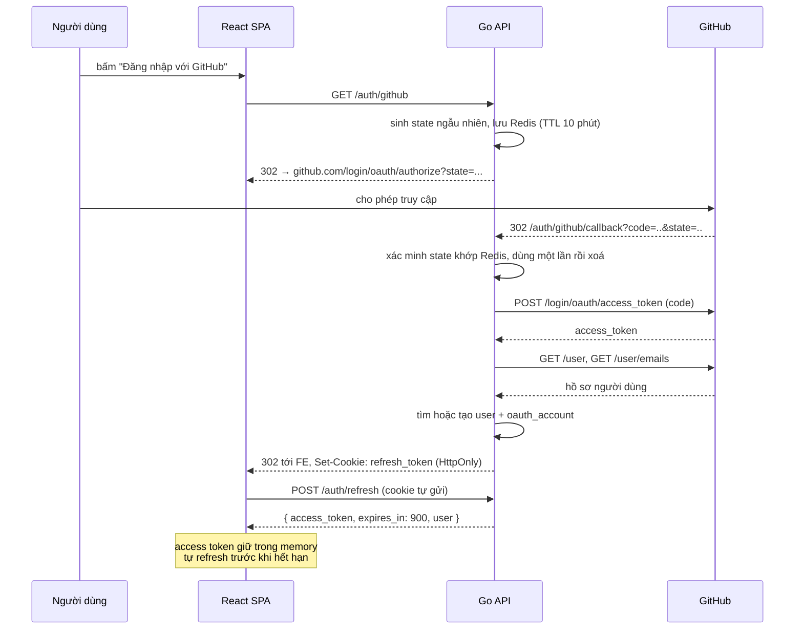

# 03 — API Contract

Base URL: `/api/v1`. Toàn bộ request/response dùng `application/json; charset=utf-8`.

## 1. Quy ước chung

### Định dạng lỗi

Mọi lỗi trả về cùng một hình dạng:

```json
{
  "error": {
    "code": "validation_failed",
    "message": "Dữ liệu gửi lên không hợp lệ",
    "fields": { "title": "không được để trống" }
  }
}
```

**Mã tra cứu log nằm ở header `X-Request-ID`, không nằm trong body.** Lý do là kỹ thuật: `huma` dựng body lỗi qua một hàm không nhận `context`, nên nó không thể biết request id. Header thì middleware set được, và mọi response — kể cả 404 do router trả — đều có.

| HTTP | `code` | Khi nào |
|---|---|---|
| 400 | `invalid_request` | JSON hỏng, tham số sai kiểu |
| 401 | `unauthenticated` | thiếu token / token hết hạn |
| 403 | `forbidden` | đã đăng nhập nhưng không sở hữu tài nguyên |
| 404 | `not_found` | không tồn tại, hoặc tồn tại nhưng người gọi không được phép biết |
| 405 | `method_not_allowed` | đường dẫn đúng nhưng sai phương thức |
| 409 | `conflict` | slug trùng, đã reaction rồi |
| 422 | `validation_failed` | cú pháp đúng nhưng vi phạm nghiệp vụ |
| 429 | `rate_limited` | kèm header `Retry-After` |
| 503 | `service_unavailable` | phụ thuộc không trả lời |
| 500 | `internal_error` | tra log bằng `X-Request-ID` |

Nguyên tắc: `message` viết cho người đọc và có thể hiện thẳng lên UI. `code` là thứ frontend `switch` theo — **không** parse `message`.

### Phân trang

Dùng **cursor**, không dùng `offset`. Lý do: feed thay đổi liên tục, `offset` khiến bài bị lặp hoặc bị nhảy cóc khi có bài mới chèn vào giữa lúc người dùng cuộn trang.

```
GET /api/v1/posts?limit=20&cursor=eyJwIjoiMjAyNi0wNy0yMFQxMDowMDowMFoiLCJpIjoiMDFKOC4uLiJ9
```

```json
{
  "data": [ ... ],
  "page": { "next_cursor": "eyJwIjoi...", "has_more": true }
}
```

Cursor là base64 của `{"p": published_at, "i": id}`, khớp đúng với index `(published_at DESC, id DESC)`. `limit` mặc định 20, tối đa 50. Hết dữ liệu thì `next_cursor: null`.

### Idempotency

`PUT` và `DELETE` là idempotent theo đúng nghĩa HTTP. `POST /posts/{id}/publish` gọi lại lần hai trên bài đã xuất bản trả `200` chứ không phải lỗi.

## 2. Luồng xác thực



Kiểm tra `state` là bắt buộc — thiếu nó thì kẻ tấn công có thể ép nạn nhân đăng nhập vào tài khoản GitHub của chúng (login CSRF). State sinh ngẫu nhiên 32 byte, lưu Redis, **xoá ngay sau lần dùng đầu tiên**.

### Endpoint

| Method | Path | Auth | Mô tả |
|---|---|---|---|
| `GET` | `/auth/github` | — | Chuyển hướng sang GitHub. Nhận `?redirect=` để quay lại đúng trang sau khi đăng nhập (chỉ chấp nhận đường dẫn nội bộ) |
| `GET` | `/auth/github/callback` | — | GitHub gọi về. Đặt cookie refresh, chuyển hướng về frontend |
| `POST` | `/auth/refresh` | cookie | Đổi refresh token lấy access token mới, đồng thời xoay vòng refresh token |
| `POST` | `/auth/logout` | cookie | Thu hồi refresh token hiện tại, xoá cookie |
| `POST` | `/auth/logout-all` | Bearer | Thu hồi mọi phiên của người dùng |

**`POST /auth/refresh` → 200**

```json
{
  "access_token": "eyJhbGciOiJIUzI1NiIs...",
  "token_type": "Bearer",
  "expires_in": 900,
  "user": { "id": "01J8...", "username": "locnguyen", "display_name": "Loc Nguyen", "avatar_url": "https://..." }
}
```

Trả kèm `user` để frontend không phải gọi thêm `/me` ngay sau đó — bớt một vòng round-trip lúc tải trang.

## 3. Người dùng

| Method | Path | Auth | Mô tả |
|---|---|---|---|
| `GET` | `/me` | Bearer | Hồ sơ đầy đủ của chính mình (kèm email, cài đặt) |
| `PATCH` | `/me` | Bearer | Cập nhật `display_name`, `bio`, `website_url`, `location` |
| `GET` | `/users/{username}` | — | Hồ sơ công khai |
| `GET` | `/users/{username}/posts` | — | Bài đã xuất bản của người đó, có phân trang |

`username` **không cho đổi** ở MVP. Cho đổi nghĩa là phải xử lý chuyển hướng URL cũ, chống chiếm tên bị bỏ trống, và cache bị hỏng — chưa đáng làm lúc này.

## 4. Bài viết

| Method | Path | Auth | Mô tả |
|---|---|---|---|
| `GET` | `/posts` | tuỳ chọn | Feed. Query: `sort=latest\|hot`, `tag=`, `author=`, `cursor=`, `limit=` |
| `GET` | `/posts/{id}` | tuỳ chọn | Lấy theo UUID (dùng cho editor) |
| `GET` | `/posts/by-slug/{username}/{slug}` | tuỳ chọn | Lấy theo URL công khai |
| `POST` | `/posts` | Bearer | Tạo bài, luôn ở trạng thái `draft` |
| `PATCH` | `/posts/{id}` | Bearer | Cập nhật một phần. Chỉ tác giả |
| `DELETE` | `/posts/{id}` | Bearer | Xoá mềm. Chỉ tác giả hoặc moderator |
| `POST` | `/posts/{id}/publish` | Bearer | draft → published, chốt `slug` và `published_at` |
| `POST` | `/posts/{id}/unpublish` | Bearer | published → draft |
| `GET` | `/me/posts` | Bearer | Bài của chính mình, `?status=draft\|published\|all` |
| `POST` | `/posts/{id}/views` | — | Ghi nhận lượt xem (fire-and-forget, gộp trong Redis) |

**Vì sao có `auth: tuỳ chọn`:** cùng một endpoint phục vụ cả khách vãng lai lẫn người đã đăng nhập. Có token thì response kèm thêm `viewer_state` (đã thả reaction chưa, đã bookmark chưa); không có thì bỏ trường đó. Tránh phải làm hai endpoint song song.

### `POST /posts` — request

```json
{
  "title": "Hiểu về goroutine leak",
  "subtitle": "Và cách phát hiện bằng pprof",
  "body_markdown": "## Mở đầu\n...",
  "cover_image_url": null,
  "tags": ["go", "concurrency", "debugging"],
  "canonical_url": null
}
```

Validate: `title` 1–200 ký tự; `body_markdown` ≤ 200 000 ký tự; tối đa 4 tag, mỗi tag khớp `^[a-z0-9][a-z0-9-]{0,29}$`.

### Post object — response

```json
{
  "id": "01J8X2...",
  "slug": "hieu-ve-goroutine-leak",
  "url": "/@locnguyen/hieu-ve-goroutine-leak",
  "title": "Hiểu về goroutine leak",
  "subtitle": "Và cách phát hiện bằng pprof",
  "body_html": "<h2>Mở đầu</h2>...",
  "cover_image_url": null,
  "status": "published",
  "reading_minutes": 7,
  "tags": [{ "name": "go", "color_key": "cyan" }],
  "author": {
    "id": "01J8...", "username": "locnguyen",
    "display_name": "Loc Nguyen", "avatar_url": "https://..."
  },
  "stats": { "reactions": 42, "comments": 8, "views": 1503 },
  "viewer_state": { "reacted": ["like"], "bookmarked": false },
  "published_at": "2026-07-20T10:00:00Z",
  "updated_at": "2026-07-21T03:12:00Z"
}
```

Trong danh sách feed, `body_html` được thay bằng `excerpt` (200 ký tự đầu, đã lột thẻ HTML) — trả nguyên nội dung 20 bài sẽ khiến response phình lên hàng megabyte.

**Sinh slug:** chuẩn hoá tiêu đề (bỏ dấu tiếng Việt, hạ chữ thường, thay khoảng trắng bằng `-`) rồi nối hậu tố ngẫu nhiên 6 ký tự nếu đã trùng trong phạm vi tác giả. Slug **cố định sau khi xuất bản** — đổi slug là làm hỏng link người khác đã chia sẻ.

## 5. Bình luận

| Method | Path | Auth | Mô tả |
|---|---|---|---|
| `GET` | `/posts/{id}/comments` | tuỳ chọn | Toàn bộ cây bình luận, một lần gọi |
| `POST` | `/posts/{id}/comments` | Bearer | Tạo. Body: `{ body_markdown, parent_id? }` |
| `PATCH` | `/comments/{id}` | Bearer | Sửa, chỉ tác giả, chỉ trong 30 phút đầu |
| `DELETE` | `/comments/{id}` | Bearer | Xoá mềm |

`GET .../comments` trả về cây đã lồng sẵn (tối đa 2 tầng), không phân trang — bài viết kỹ thuật hiếm khi vượt vài trăm bình luận. Nếu sau này có bài bùng nổ, thêm phân trang ở tầng gốc, cấu trúc response không đổi.

Bình luận đã xoá vẫn xuất hiện nếu còn trả lời bên dưới, dưới dạng:

```json
{ "id": "...", "deleted": true, "body_html": null, "author": null, "replies": [ ... ] }
```

## 6. Reaction & Bookmark

| Method | Path | Auth | Mô tả |
|---|---|---|---|
| `PUT` | `/posts/{id}/reactions/{kind}` | Bearer | Thả reaction. `kind` ∈ `like`, `unicorn`, `mind_blown` |
| `DELETE` | `/posts/{id}/reactions/{kind}` | Bearer | Gỡ reaction |
| `PUT` | `/posts/{id}/bookmark` | Bearer | Lưu bài |
| `DELETE` | `/posts/{id}/bookmark` | Bearer | Bỏ lưu |
| `GET` | `/me/bookmarks` | Bearer | Danh sách đã lưu, phân trang |

Dùng `PUT`/`DELETE` thay vì `POST /toggle`: toggle không idempotent, mà đây chính xác là chỗ hay bị double-click hoặc retry mạng. `PUT` hai lần vẫn ra một reaction.

Response trả về số đếm mới để frontend đồng bộ lại sau khi cập nhật lạc quan (optimistic update):

```json
{ "reaction_count": 43, "viewer_reacted": ["like"] }
```

## 7. Tag & Tìm kiếm

| Method | Path | Auth | Mô tả |
|---|---|---|---|
| `GET` | `/tags?q=&limit=` | — | Autocomplete khi gõ tag trong editor |
| `GET` | `/tags/popular` | — | Top tag theo `post_count` |
| `GET` | `/search?q=&type=posts\|users&cursor=` | — | Tìm kiếm toàn văn |

`GET /search` yêu cầu `q` tối thiểu 2 ký tự. Rate limit chặt hơn phần còn lại (30 req/phút/IP) vì đây là endpoint tốn tài nguyên nhất.

## 8. Tải ảnh lên

| Method | Path | Auth | Mô tả |
|---|---|---|---|
| `POST` | `/uploads/presign` | Bearer | Xin URL upload trực tiếp lên S3 |

```json
// request
{ "content_type": "image/png", "size_bytes": 482913 }
// response
{ "upload_url": "https://...", "public_url": "https://cdn/...", "expires_in": 300 }
```

File đi thẳng từ trình duyệt lên S3, không đi qua API — server Go không phải giữ file vài megabyte trong bộ nhớ. Server chỉ kiểm tra `content_type` thuộc danh sách cho phép (`png`, `jpeg`, `webp`, `gif`) và `size_bytes` ≤ 5 MB trước khi ký URL.

## 9. Rate limit

Sliding window trên Redis. Response luôn kèm `X-RateLimit-Limit`, `X-RateLimit-Remaining`, `X-RateLimit-Reset`.

| Nhóm | Giới hạn |
|---|---|
| Đọc, chưa đăng nhập | 100 req/phút/IP |
| Đọc, đã đăng nhập | 300 req/phút/user |
| Ghi (tạo/sửa/xoá) | 30 req/phút/user |
| Tạo bài | 10 bài/giờ/user |
| Bình luận | 20 bình luận/giờ/user |
| Tìm kiếm | 30 req/phút |

## 10. Sinh mã tự động

Backend dùng **`huma/v2`** ([05-go-stack.md §3](05-go-stack.md#3-tầng-api-humav2--quyết-định-đã-chốt)): OpenAPI 3.1 sinh ra từ chính struct Go của request/response. Vì spec sinh từ kiểu dữ liệu chứ không từ comment, nó không thể mô tả sai thứ mà code thực sự nhận và trả về.

Spec có hai đường ra, dùng cho hai mục đích khác nhau:

| Đường | Mục đích |
|---|---|
| `/openapi.json` + `/docs` lúc chạy | cho người đọc |
| `go run ./cmd/api openapi` | cho sinh code — **không khởi động server**, nên CI không cần Postgres/Redis |

Chuỗi sinh kiểu (`make openapi`):

```
go run ./cmd/api openapi  >  docs/openapi.yaml
openapi-typescript        >  frontend/src/shared/types/api.ts   (sinh tự động)
                             frontend/src/shared/types/index.ts (alias viết tay)
```

`openapi-typescript` sinh kiểu lồng sâu (`components["schemas"]["PostDTO"]`), nên có thêm một file alias mỏng để component chỉ cần `import type { Post } from "@/shared/types"`.

Cả `openapi.yaml` lẫn `api.ts` đều commit vào repo. CI chạy `make openapi && git diff --exit-code` — đổi struct Go mà quên sinh lại type thì CI đỏ, tránh đúng cái trôi lệch mà việc chọn `huma` sinh ra để ngăn.

Lợi ích thực tế: đổi tên một trường trong response Go làm frontend **lỗi biên dịch** ngay, thay vì lỗi `undefined` lúc chạy. Đây là ràng buộc rẻ nhất giữ hai bên khỏi trôi lệch khi chỉ có một người làm cả hai đầu.
